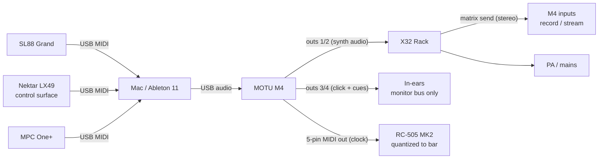

# Live Looping Rig — Build Doc

Win's live looping show: rig design, gear plan, and the deals in motion around it.
Update this doc as decisions land. Log changes at the bottom.

**Status:** Pre-pitch. Nothing purchased yet. Waiting on the Will call.
**Last updated:** 2026-08-24

---

## 1. The Hilton Deal

Pitch to **Will at the Capital Hilton**: a **show-development fee of $2,000–3,000 upfront**, covering:

- ~7 weeks of building the live looping show
- The two missing pieces of gear (keyboard + looper)

Terms that matter:

- **Gear is bought by me and stays mine.** The fee funds development; ownership doesn't transfer.
- After the build: a run of shows in **consecutive-night blocks**.
- The full show then stays in my catalog: **$1,125/night full rig, $400 acoustic**.

Pitch sequence: **call Will first**, then send **3 short recap texts**.

The synth software (§5) appears in the pitch **only as a differentiator** — not as a line item, not billed to clients.

## 2. Gear to Buy

| Item | Price | Why |
|---|---|---|
| Studiologic SL88 Grand | ~$850–1,000 | Wooden-key Fatar action. Kawai VPC1 ruled out — Sweetwater has it at $2,999. |
| Boss RC-505 MK2 | ~$599 | Hardware looper — loops survive a computer crash (§4). |
| MOTU M4 | ~$250 | Swapped from the M2 plan: need 4 outputs (mains pair + in-ear pair). |

**Total: ~$1,700–1,850.**

Note: the Hilton fee framing covers the *two* missing pieces (keyboard + looper); the M2→M4 swap is my own plan change.

## 3. Gear I Own

- **Nektar LX49** — pads are dull; repurposing as Ableton control surface
- **MPC One+** — pad/beat station
- **Behringer X32 Rack** (spare)
- Drums, mics, PA
- **Ableton 11 Suite**, Logic
- **Moog Model D + Model 15** plugins

## 4. Signal Flow

- **Keyboards/MPC → USB MIDI → Mac/Ableton.**
- **M4 outs 1/2 → X32** — synth audio to the console.
- **M4 outs 3/4 → in-ears** — click + cue markers. Monitor bus only, **never mains**.
- **M4 5-pin MIDI out → RC-505.** Ableton is clock master; looper quantized to bar.
- **Record/stream:** X32 matrix send → M4 inputs, stereo.

### Design rules (why it's built this way)

1. **No aggregate devices.** Mac aggregates run at the slowest interface. One interface: the M4.
2. **Loops live in hardware.** A computer hiccup can't kill accumulated loop state.
3. **Buffer stays tight (64–128 samples)** for one constraint: synth latency under the keyboard.

### Routing not yet pinned down

- RC-505 audio I/O: which X32 channels take the looper outs, and what feeds its inputs (vocal mic? synth bus?).
- X32 scene: channel map, monitor bus assignments, matrix config for the record feed.

## 5. Synth Software Audition

My audio engineer buddy's synth: DAW-like, all instruments in one GUI, **velocity drives the synthesis itself**. My investment — not billed to clients. Needs a Mac port.

**Plan:** use the ~2-week SL88 delivery window as the audition.

**Gig test — pass requires all three:**

1. Runs 1 hour, no crash
2. Silent patch changes
3. Feels right at the tight buffer (64–128)

- **Pass** → it's my one instrument.
- **Fail** → fall back to Moog plugins / Ableton sounds.

Possible licensing conversation later, once proven on stage. Until then it's only a pitch differentiator (§1).

## 6. Also in Motion

- **49 West co-bill:** emailed Sarah (Sarah49west@gmail.com) — co-bill with Josh, any night **Oct 15–18** (Annapolis Sailboat Show weekend, dates confirmed). Josh opens folk set, I follow. **Did not mention the looper show** — that's contingent on Will.
- **Josh drum tracking:** wants to fly me down ~late Sept/Oct to track drums.

## 7. Open Loops

- [ ] Call Will → send 3 recap texts
- [ ] Sarah's reply on the Oct 15–18 co-bill
- [ ] Order SL88 + RC-505 MK2 + M4 (after the fee lands, or decide to self-fund)
- [ ] Synth Mac port status — needs to exist before the audition window opens
- [ ] Pin down RC-505 ↔ X32 routing + X32 scene (§4)
- [ ] Schedule Josh drum-tracking trip (late Sept/Oct)

---

## Changelog

- **2026-08-24** — Initial doc from Cowork session handoff. M2→M4 swap recorded. VPC1 ruled out.
